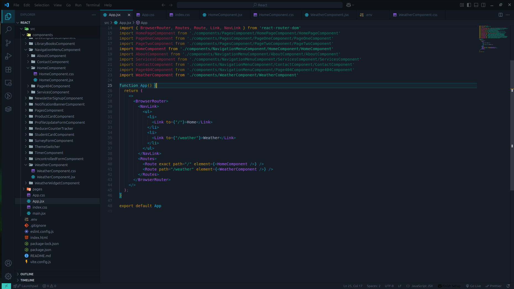
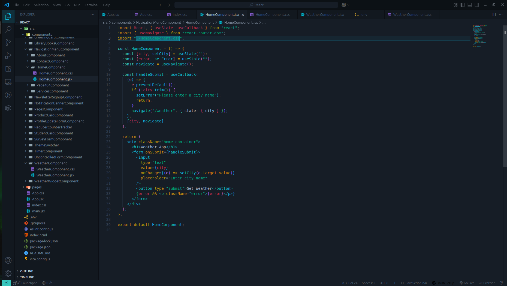
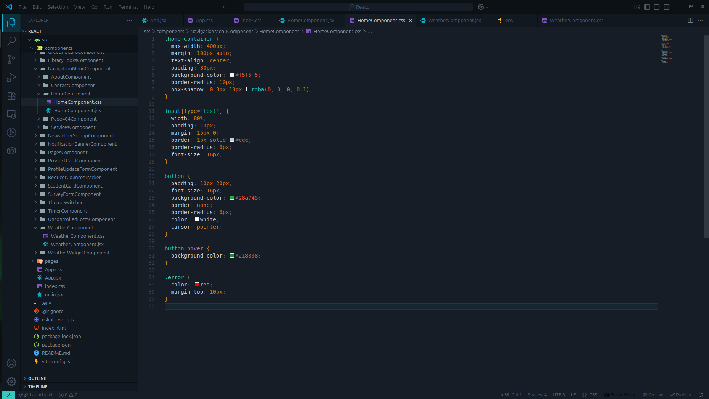
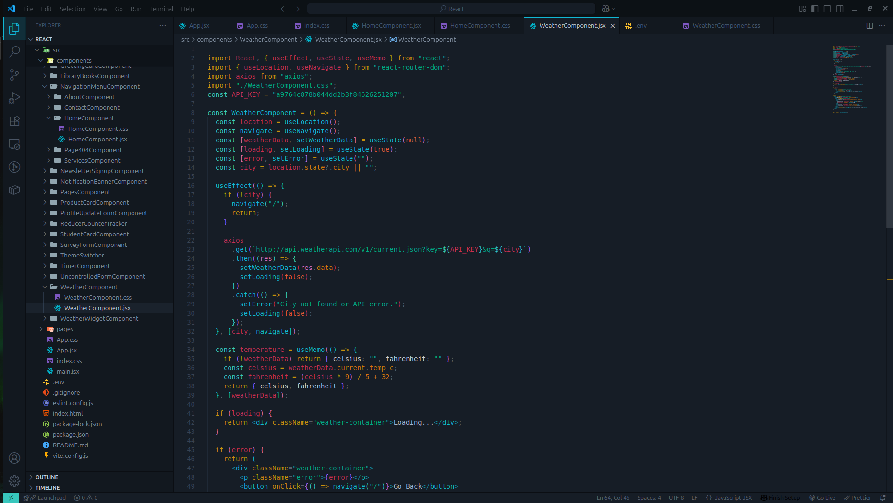
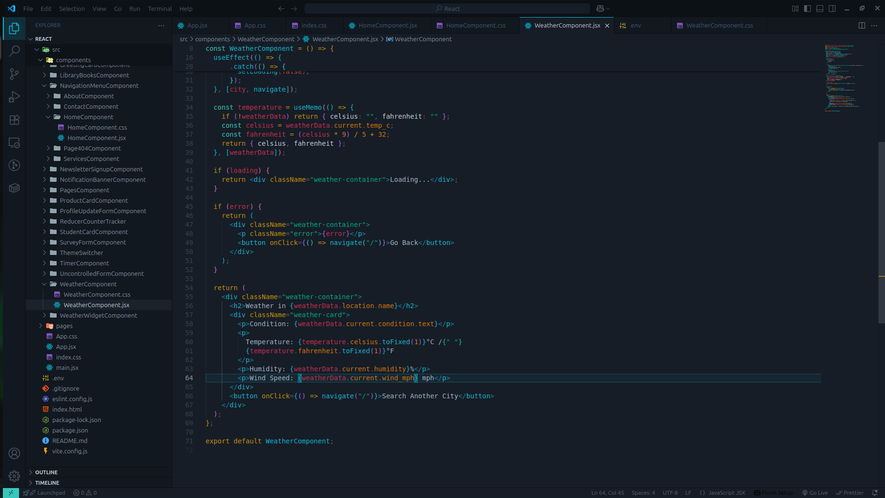
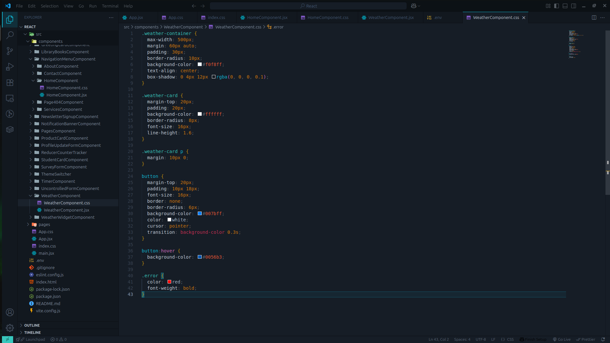
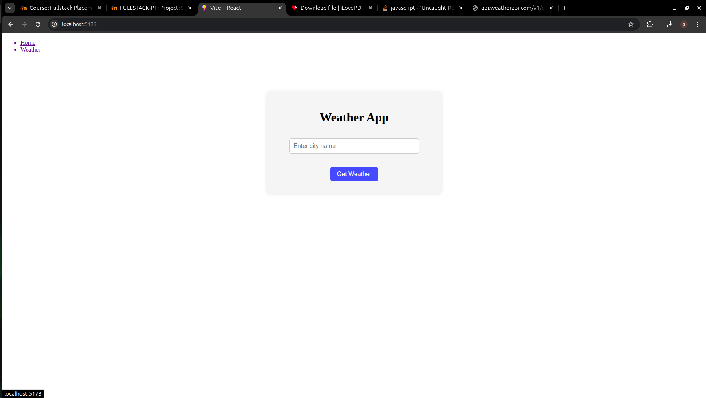
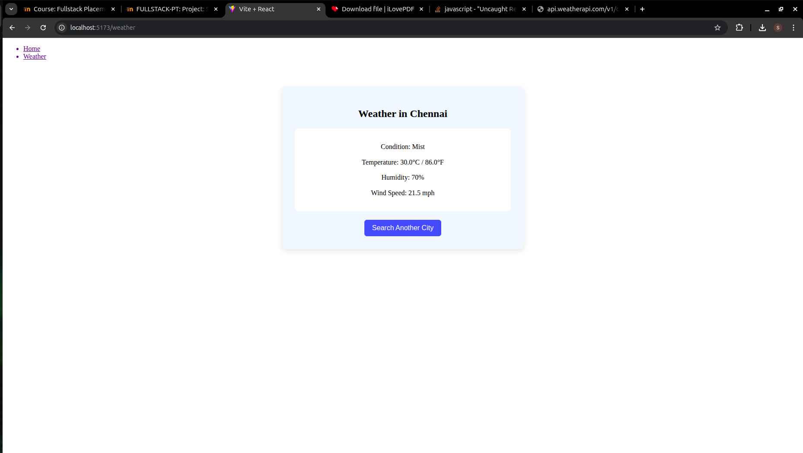

# SkyCast - Find My Weather
## Date: 20/07/2025
## Objective:
To build a responsive single-page application using React that allows users to enter a city name and retrieve real-time weather information using the OpenWeatherMap API. This project demonstrates the use of Axios for API calls, React Router for navigation, React Hooks for state management, controlled components with validation, and basic styling with CSS.
## Tasks:

#### 1. Project Setup
Initialize React app.

Install necessary dependencies: npm install axios react-router-dom

#### 2. Routing
Set up BrowserRouter in App.js.

Create two routes:

/ – Home page with input form.

/weather – Page to display weather results.

#### 3. Home Page (City Input)
Create a controlled input field for the city name.

Add validation to ensure the input is not empty.

On valid form submission, navigate to /weather and store the city name.

#### 4. Weather Page (API Integration)
Use Axios to fetch data from the OpenWeatherMap API using the city name.

Show temperature, humidity, wind speed, and weather condition.

Convert and display temperature in both Celsius and Fahrenheit using useMemo.

#### 5. React Hooks
Use useState for managing city, weather data, and loading state.

Use useEffect to trigger the Axios call on page load.

Use useCallback to optimize form submit handler.

Use useMemo for temperature conversion logic.

#### 6. UI Styling (CSS)
Create a responsive and clean layout using CSS.

Style form, buttons, weather display cards, and navigation links.

## Programs:

### App.jsx
```jsx
import './App.css'
import { BrowserRouter, Routes, Route, Link, NavLink } from 'react-router-dom'
import HomeComponent from './components/NavigationMenuComponent/HomeComponent/HomeComponent'
import WeatherComponent from './components/WeatherComponent/WeatherComponent'

function App() {
  return (
    <>
      <BrowserRouter>
        <NavLink>
          <ul>
            <li>
              <Link to={"/"}>Home</Link>
            </li>
            <li>
              <Link to={"/weather"}>Weather</Link>
            </li>
          </ul>
        </NavLink>
        <Routes>
          <Route exact path="/" element={<HomeComponent />} />
          <Route path="/weather" element={<WeatherComponent />} />
        </Routes>
      </BrowserRouter>
    </>
  );
}

export default App

```
### HomeComponent.jsx
```jsx
import React, { useState, useCallback } from "react";
import { useNavigate } from "react-router-dom";
import "./HomeComponent.css";

const HomeComponent = () => {
  const [city, setCity] = useState("");
  const [error, setError] = useState("");
  const navigate = useNavigate();

  const handleSubmit = useCallback(
    (e) => {
      e.preventDefault();
      if (!city.trim()) {
        setError("Please enter a city name");
        return;
      }
      navigate("/weather", { state: { city } });
    },
    [city, navigate]
  );

  return (
    <div className="home-container">
      <h1>Weather App</h1>
      <form onSubmit={handleSubmit}>
        <input
          type="text"
          value={city}
          onChange={(e) => setCity(e.target.value)}
          placeholder="Enter city name"
        />
        <button type="submit">Get Weather</button>
        {error && <p className="error">{error}</p>}
      </form>
    </div>
  );
};

export default HomeComponent;
```
### HomeComponent.css
```css
.home-container {
  max-width: 400px;
  margin: 100px auto;
  text-align: center;
  padding: 30px;
  background-color: #f5f5f5;
  border-radius: 10px;
  box-shadow: 0 3px 10px rgba(0, 0, 0, 0.1);
}

input[type="text"] {
  width: 80%;
  padding: 10px;
  margin: 15px 0;
  border: 1px solid #ccc;
  border-radius: 6px;
  font-size: 16px;
}

button {
  padding: 10px 20px;
  font-size: 16px;
  background-color: #28a745;
  border: none;
  border-radius: 6px;
  color: white;
  cursor: pointer;
}

button:hover {
  background-color: #218838;
}

.error {
  color: red;
  margin-top: 10px;
}
```
### WeatherComponent.jsx
```jsx

import React, { useEffect, useState, useMemo } from "react";
import { useLocation, useNavigate } from "react-router-dom";
import axios from "axios";
import "./WeatherComponent.css";
const API_KEY = "a9764c878b044dd2b3f84626251207";

const WeatherComponent = () => {
  const location = useLocation();
  const navigate = useNavigate();
  const [weatherData, setWeatherData] = useState(null);
  const [loading, setLoading] = useState(true);
  const [error, setError] = useState("");
  const city = location.state?.city || "";

  useEffect(() => {
    if (!city) {
      navigate("/");
      return;
    }

    axios
      .get(`http://api.weatherapi.com/v1/current.json?key=${API_KEY}&q=${city}`)
      .then((res) => {
        setWeatherData(res.data);
        setLoading(false);
      })
      .catch(() => {
        setError("City not found or API error.");
        setLoading(false);
      });
  }, [city, navigate]);

  const temperature = useMemo(() => {
    if (!weatherData) return { celsius: "", fahrenheit: "" };
    const celsius = weatherData.current.temp_c;
    const fahrenheit = (celsius * 9) / 5 + 32;
    return { celsius, fahrenheit };
  }, [weatherData]);

  if (loading) {
    return <div className="weather-container">Loading...</div>;
  }

  if (error) {
    return (
      <div className="weather-container">
        <p className="error">{error}</p>
        <button onClick={() => navigate("/")}>Go Back</button>
      </div>
    );
  }

  return (
    <div className="weather-container">
      <h2>Weather in {weatherData.location.name}</h2>
      <div className="weather-card">
        <p>Condition: {weatherData.current.condition.text}</p>
        <p>
          Temperature: {temperature.celsius.toFixed(1)}°C /{" "}
          {temperature.fahrenheit.toFixed(1)}°F
        </p>
        <p>Humidity: {weatherData.current.humidity}%</p>
        <p>Wind Speed: {weatherData.current.wind_mph} mph</p>
      </div>
      <button onClick={() => navigate("/")}>Search Another City</button>
    </div>
  );
};

export default WeatherComponent;
```
### WeatherComponent.css
```css
.weather-container {
  max-width: 500px;
  margin: 60px auto;
  padding: 30px;
  border-radius: 10px;
  background-color: #f0f8ff;
  text-align: center;
  box-shadow: 0 4px 12px rgba(0, 0, 0, 0.1);
}

.weather-card {
  margin-top: 20px;
  padding: 20px;
  background-color: #ffffff;
  border-radius: 8px;
  font-size: 16px;
  line-height: 1.6;
}

.weather-card p {
  margin: 10px 0;
}

button {
  margin-top: 20px;
  padding: 10px 18px;
  font-size: 16px;
  border: none;
  border-radius: 6px;
  background-color: #007bff;
  color: white;
  cursor: pointer;
  transition: background-color 0.3s;
}

button:hover {
  background-color: #0056b3;
}

.error {
  color: red;
  font-weight: bold;
}
```
## Output:








## Result:
A responsive single-page application using React that allows users to enter a city name and retrieve real-time weather information using the OpenWeatherMap API has been built successfully. 
